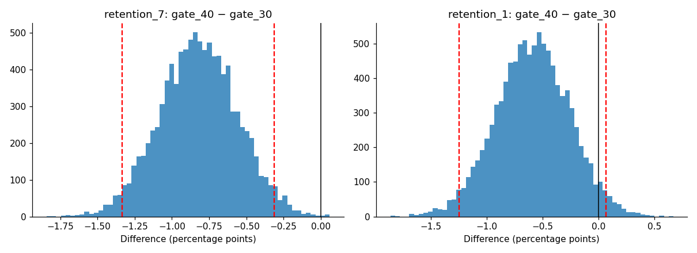
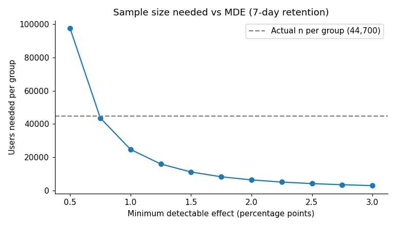
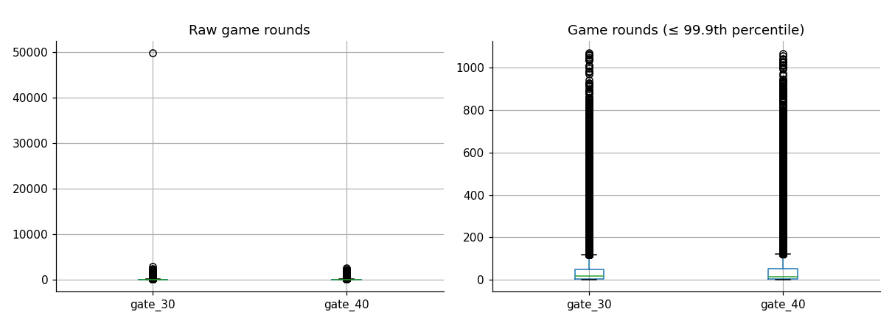

# A/B Test Analysis: Should Cookie Cats Move Its First Gate?

**Recommendation: don't ship. Moving the first gate from level 30 to level 40 significantly reduced 7-day retention by 0.82 percentage points (p = 0.0016).**

An end-to-end analysis of a randomised experiment on 90,189 mobile game players using SQL and Python. It covers a pre-set analysis plan, power analysis, data quality checks, significance testing, a guardrail metric and a written product recommendation. It ends with a design for a comparable experiment in a banking product.



## The question

Cookie Cats is a mobile puzzle game. At certain levels, players hit a "gate" and must either wait or pay to continue. The game team tested moving the first gate from **level 30 (control)** to **level 40 (treatment)**, with new players randomly assigned to one version.

**Does the change affect whether players keep coming back?**

## Results

| Metric | gate_30 | gate_40 | Difference [95% CI] | p-value |
|---|---:|---:|---:|---:|
| **7-day retention (primary)** | 19.02% | 18.20% | −0.82pp [−1.33, −0.31] | 0.0016 |
| 1-day retention (secondary) | 44.82% | 44.23% | −0.59pp [−1.24, 0.06] | 0.074 |
| Game rounds (guardrail) | median 17 | median 16 | mean −0.10 [−1.30, 1.23] | 0.050 (Mann-Whitney) |

- **7-day retention fell by 4.3% in relative terms.** The result remains significant after Bonferroni correction, and 99.9% of bootstrap samples show gate_40 performing worse.
- **1-day retention also dipped, but not significantly**, so it doesn't change the decision.
- **Engagement was broadly unchanged**, so the guardrail was not breached.
- **Business impact:** for every 100,000 new players, gate_40 would mean roughly 820 fewer players still active after a week.

## Approach

### 1. Analysis plan first

Before looking at results, I set 7-day retention as the primary metric, 1-day retention as secondary, and game rounds as a guardrail.

I also fixed α = 0.05, power = 0.8, a minimum detectable effect of 1 percentage point, and the decision rule: ship only if the primary metric improves significantly and the guardrail doesn't worsen.

### 2. Metrics in SQL

Group-level metrics, sample ratio inputs and outlier detection are calculated with SQL queries using DuckDB, mirroring how the data would be pulled from a warehouse.

The queries use aggregation, window functions and CTEs.

### 3. Power analysis

Detecting a 1pp change in 7-day retention needs about 24,700 players per group. The experiment had 44,700+ players per group, giving 96.5% power.



### 4. Data quality checks

- **Sample ratio mismatch:** the split was 49.56% / 50.44% (chi-square p = 0.0086). This is a mild mismatch. Without assignment logs the cause can't be investigated, so I proceed but report it as a key limitation.
- **Outliers:** one player logged 49,854 rounds (the next highest was 2,961). Game rounds are heavily skewed, so I used a rank-based test and winsorised the data at the 99.9th percentile rather than relying on raw means.
 

### 5. Significance testing

Two-proportion z-tests with confidence intervals for both retention metrics, a Bonferroni correction for multiple comparisons, and a bootstrap with 10,000 resamples as a robustness check.

### 6. Guardrail

A Mann-Whitney U test, plus a bootstrap of the difference in winsorised means.

## Limitations

- There is a mild sample ratio mismatch, which in practice I would investigate in the assignment pipeline before acting.
- The power analysis baseline came from the control group rather than pre-experiment data.
- Retention is only measured at days 1 and 7. Longer-term retention and revenue effects are unknown.

## Next steps

Test other gate positions (for example, level 25 or 35), measure the effect on in-app purchases, and check whether the effect differs between casual and highly engaged players.

## Applying the framework to banking

The notebook ends with a hypothetical experiment for a digital bank: prompting new customers to open a savings pot after their first salary arrives.

It sets out the design, metrics and a power analysis. The key difference from a game is that guardrails focus on **customer harm**. For example, declined payments due to insufficient funds would block a launch even if savings adoption improved, in line with the FCA's Consumer Duty.

## Data

The dataset is not stored in this repository. It is publicly available from [Kaggle – Mobile Games A/B Testing: Cookie Cats](https://www.kaggle.com/datasets/mursideyarkin/mobile-games-ab-testing-cookie-cats).

Download `cookie_cats.csv` and place it in the repository root before running the notebook.

## How to run

1. Download `cookie_cats.csv` from the [Kaggle dataset](https://www.kaggle.com/datasets/mursideyarkin/mobile-games-ab-testing-cookie-cats).
2. Place `cookie_cats.csv` in the same folder as the notebook.
3. Install the dependencies with `pip install -r requirements.txt`.
4. Open `cookie_cats_ab_test.ipynb` in Jupyter.
5. Choose **Run All Cells**.

## Repository structure

```text
cookie-cats-ab-test/
├── README.md
├── cookie_cats_ab_test.ipynb
├── requirements.txt
├── .gitignore
└── figures/
    └── charts generated by the notebook
